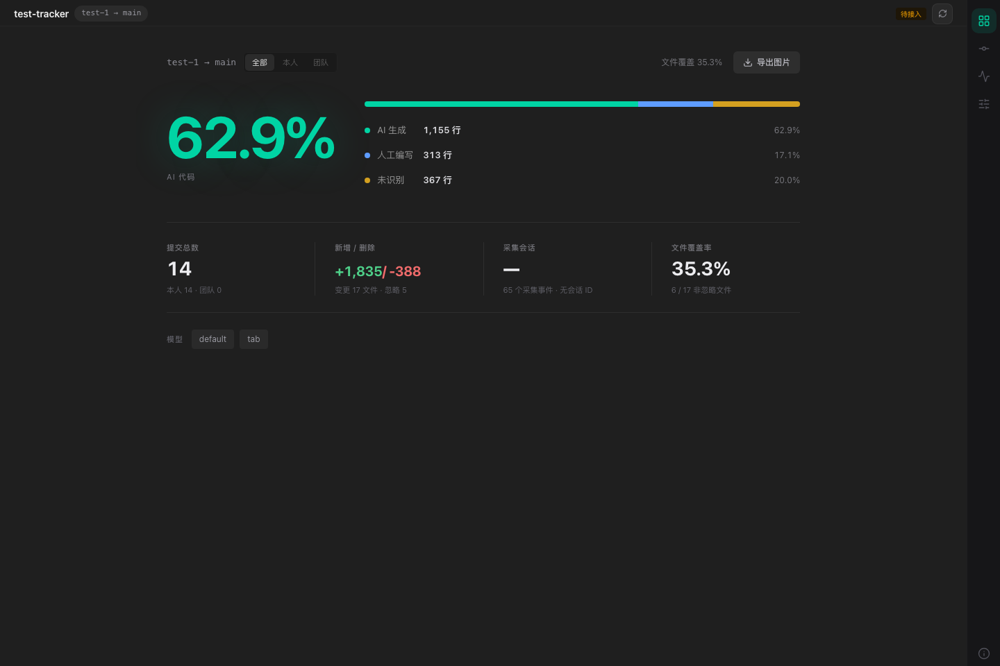
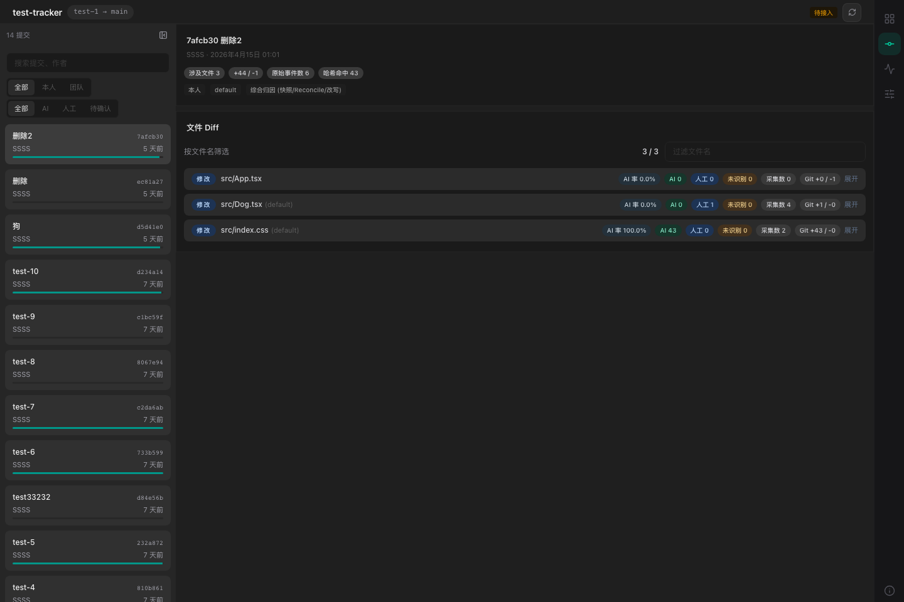
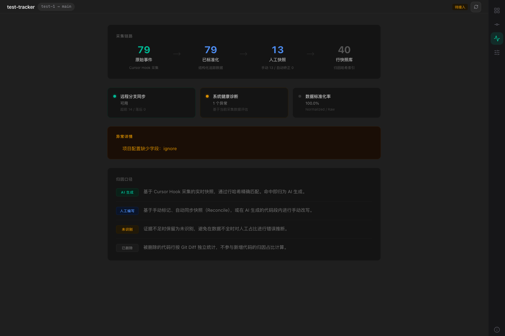
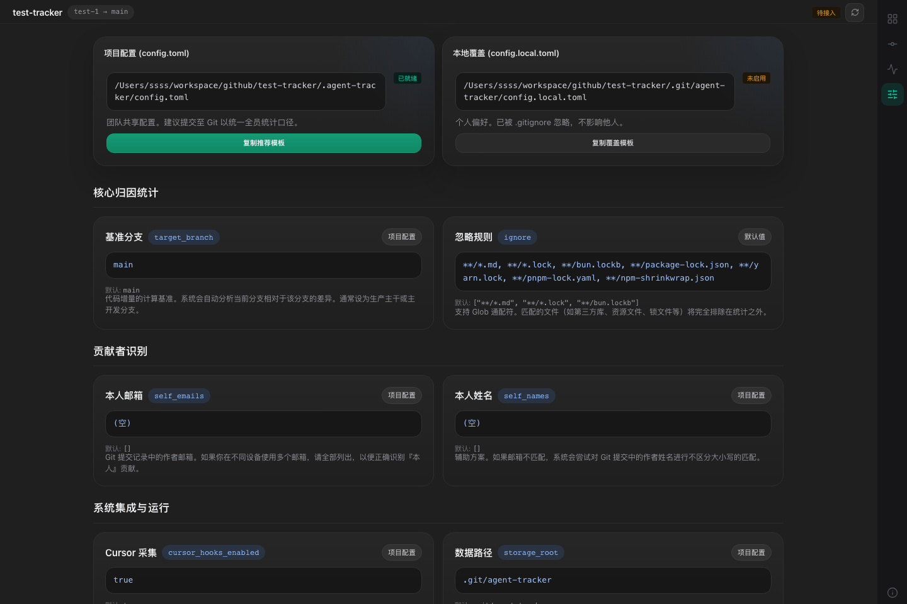

# agent-tracker

`agent-tracker` 是一个面向 Git 仓库的 AI 代码归因工具。它通过 Cursor Hooks 采集编辑证据，并结合 commit diff、文件快照和行级 hash，统计当前分支中 AI、人工和未识别代码的占比。

项目优先服务两个问题：

- 当前分支有多少最终留下来的代码来自 AI？
- 每个 commit、每个文件、每一段 diff 的归因证据是什么？

> 当前项目处于早期版本，默认面向 Bun 运行时。

## 截图

### 概览



### 提交工作台



### 健康检查



### 设置



## 功能

- Cursor Hooks 采集：记录 Cursor 文件编辑、工具调用和会话事件。
- 行级归因：按 `AI / Human / Unknown` 统计最终新增内容。
- Commit 下钻：从分支汇总进入 commit，再进入文件 diff。
- Web Dashboard：提供概览、提交工作台、健康检查和设置页面。
- TUI 入口：运行 `agent-tracker` 进入终端界面。
- 本地存储：采集数据默认放在 `.git/agent-tracker/`，不污染仓库源码。
- 忽略规则：支持把 lockfile、构建产物、工具自身文件排除出统计。
- 图片导出：概览页支持导出当前统计图。

## 快速开始

安装：

```bash
bun add -g @shiyangzhaoa/agent-tracker
```

启动终端界面：

```bash
agent-tracker
```

启动 Web Dashboard：

```bash
agent-tracker dashboard --open
```

本地开发：

```bash
bun install
```

构建：

```bash
bun run build
```

启动终端界面：

```bash
bun run dev
```

启动 Web Dashboard：

```bash
bun run dashboard
```

如果使用构建产物：

```bash
bun ./dist/index.js
bun ./dist/index.js dashboard --open
```

## 推荐流程

1. 在目标仓库运行 `agent-tracker` 或打开 dashboard。
2. 在设置页检查项目配置和 Cursor 集成状态。
3. 安装 Cursor Hooks 后，正常使用 Cursor 生成或修改代码。
4. 提交代码后，在概览页查看当前分支总体占比。
5. 进入提交工作台，检查具体 commit 和文件 diff 的归因证据。

## 指标口径

`agent-tracker` 使用混合汇总口径：

- 文件维度按路径去重。同一个文件被多个 commit 修改，文件覆盖率里只算一个文件。
- 行数维度按 commit 累加。同一个文件被多个 commit 反复修改，每次新增、删除和归因行数都会累计。
- `AI / Human / Unknown` 只统计新侧最终留下来的新增内容。
- `Git 删除` 单独统计，不参与 `AI / Human / Unknown` 主占比。
- 被删除代码的原始来源会作为证据保留，例如 AI 源删除、Human 源删除、未知源删除。

归因含义：

- `AI`：命中 Cursor 采集事件或 AI 文件快照 hash。
- `Human`：命中人工快照、reconcile 快照，或检测到对已知 AI 行的人工改写。
- `Unknown`：证据不足，保留为未识别，避免虚高人工占比。

## 数据存储

默认目录：

```text
.git/agent-tracker/
```

常见内容：

- `raw/*.jsonl`：原始 Hook 事件。
- `hook-payloads/*.jsonl`：调试用 Hook payload。
- `cache/`：文件快照和中间缓存。
- `index.sqlite`：后续索引用数据库。

项目配置默认放在：

```text
.agent-tracker/config.toml
```

本地覆盖配置默认放在：

```text
.git/agent-tracker/config.local.toml
```

## Cursor 集成

初始化后，工具会增量合并 `.cursor/hooks.json`，不会粗暴覆盖已有 hooks。安装器会把 agent-tracker 的 hook handler 写入：

```text
.cursor/hooks/agent-tracker-hook.sh
```

当前采集重点包括：

- `afterFileEdit`
- `afterTabFileEdit`
- `postToolUse`
- `afterShellExecution`
- `sessionStart`
- `sessionEnd`

## 命令

开发时常用：

```bash
bun run dev
bun run dashboard
bun run check
bun run build
```

构建产物：

```bash
bun ./dist/index.js
bun ./dist/index.js dashboard --open
```

内部 Hook 入口：

```bash
bun ./dist/index.js collect cursor hook
```

## 项目结构

```text
src/
  commands/       CLI 和内部命令
  lib/            Git、配置、归因、trace、diff 等核心逻辑
  tui/            Ink 终端界面
  web/            React Dashboard
docs/
  assets/readme/  README 截图
```

## 开发

类型检查：

```bash
bun run check
```

构建：

```bash
bun run build
```

重启 dashboard：

```bash
bun run dashboard:restart
```

## 当前状态

已支持：

- Cursor 作为第一类采集源。
- 分支、commit、文件三级统计。
- Web Dashboard 和 TUI。
- AI/Human/Unknown 行级口径。
- 忽略文件过滤。
- 首页图片导出。

暂未支持 / TODO：

- 云端同步。
- 多人共享 dashboard。
- 除 Cursor 外的其他 AI 工具适配。
- AI 调用 tool 生成的代码暂未完整统计；这类代码是否应直接计入 AI 归因，还是按工具结果、文件快照或用户确认动作二次判断，策略还需要继续设计。

## License

MIT
